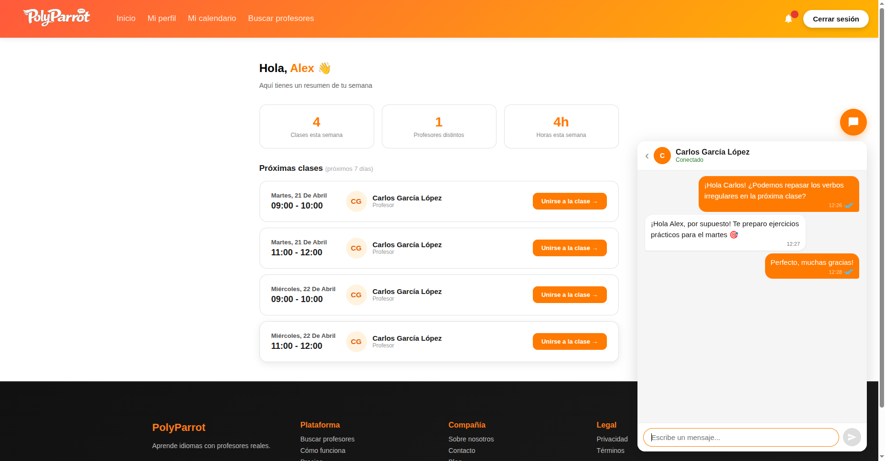
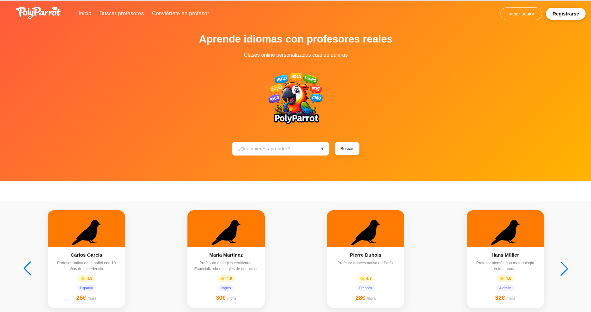
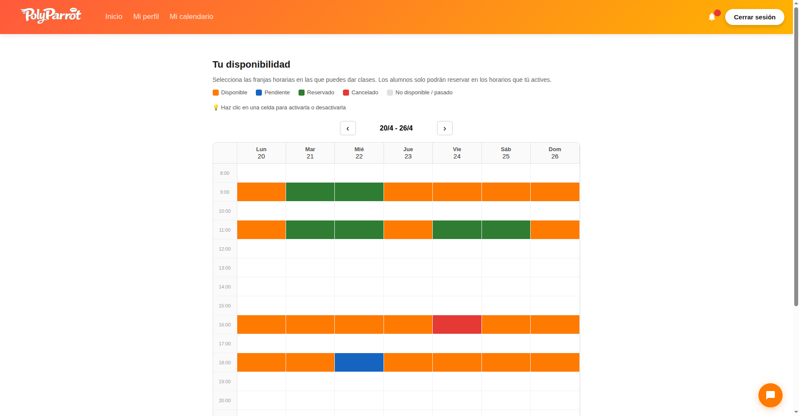

# 🦜 PolyParrot

> A language learning platform connecting students with native teachers — built with a microservices architecture.





---

## What is PolyParrot?

PolyParrot is a full-stack web application inspired by platforms like Preply and iTalki. Students can search for teachers by language, price, and availability, book classes, chat in real time, and receive instant notifications — all from a single interface.

---

## Architecture

PolyParrot is built as a **microservices system** where each service owns its own database and communicates through REST, Feign, WebSocket, and Apache Kafka.

```
┌─────────────────────────────────────────────────────┐
│                    Angular Frontend                  │
│                  (Nginx · port 4200)                 │
└──────────┬──────────┬──────────┬──────────┬─────────┘
           │          │          │          │
    ┌──────▼──┐ ┌─────▼───┐ ┌───▼─────┐ ┌──▼──────────┐
    │  user   │ │ teacher │ │ booking │ │    chat     │
    │ service │ │ service │ │ service │ │   service   │
    │  :8080  │ │  :8081  │ │  :8082  │ │    :8084    │
    │Postgres │ │Postgres │ │Postgres │ │   MongoDB   │
    └─────────┘ └────┬────┘ └────┬────┘ └─────────────┘
                     │  Feign   │
                     └────┬─────┘
                          │ Kafka
                   ┌──────▼──────┐
                   │notification │
                   │   service   │
                   │    :8083    │
                   │   MongoDB   │
                   └─────────────┘
```

### Services

| Service | Port | Database | Responsibilities |
|---|---|---|---|
| `user-service` | 8080 | PostgreSQL | Auth, JWT, user profiles |
| `teacher-service` | 8081 | PostgreSQL | Teacher profiles, availability slots, languages |
| `booking-service` | 8082 | PostgreSQL | Class reservations, confirmations, cancellations |
| `notification-service` | 8083 | MongoDB | Real-time notifications via Kafka + WebSocket |
| `chat-service` | 8084 | MongoDB | Real-time messaging with WebSocket (STOMP) |
| `frontend` | 4200 | — | Angular SPA served by Nginx |

---

## Tech Stack

**Backend**
- Java 17 · Spring Boot 3
- Spring Security · JWT
- Spring Data JPA · Hibernate
- Spring WebSocket · STOMP · SockJS
- Apache Kafka
- OpenFeign (inter-service communication)

**Frontend**
- Angular 17 (standalone components)
- TypeScript
- STOMP.js · SockJS-client

**Infrastructure**
- Docker · Docker Compose
- PostgreSQL 16
- MongoDB 7
- Apache Kafka · Zookeeper
- Nginx

---

## Features

- 🔐 **JWT Authentication** — stateless auth with role-based access (STUDENT / TEACHER)
- 🔒 **Security** — inter-service calls protected with a shared internal secret (`X-Internal-Secret`)
- 🔍 **Teacher search** — filter by language, price, and availability
- 📅 **Booking system** — students book classes, teachers confirm or cancel
- 💬 **Real-time chat** — WebSocket messaging with read receipts and online presence
- 🔔 **Real-time notifications** — Kafka events pushed to the browser via WebSocket
- 📆 **Weekly calendar** — visual class schedule for both students and teachers

---

## Getting Started

### Prerequisites
- Docker and Docker Compose

### 1. Clone the repository

```bash
git clone https://github.com/jose200112/polyparrot-app.git
cd polyparrot-app
```

### 2. Start everything

```bash
docker-compose up -d
```

This builds and starts all microservices, PostgreSQL (with seed data), MongoDB, Kafka, Zookeeper, and the Angular frontend. The first build takes a few minutes while Maven downloads dependencies.

### 3. Open the app

```
http://localhost:4200
```

### Demo credentials

| Role | Email | Password |
|---|---|---|
| Teacher | carlos@polyparrot.com | Parrot_1 |
| Teacher | maria@polyparrot.com | Parrot_1 |
| Student | ana@polyparrot.com | Parrot_1 |

---

## Project Structure

```
polyparrot-app/
├── backend/
│   ├── user-service/
│   ├── teacher-service/
│   ├── booking-service/
│   ├── notification-service/
│   └── chat-service/
├── frontend/
│   ├── src/
│   ├── Dockerfile
│   └── nginx.conf
├── docker/
│   └── postgres/
│       ├── 01-init-databases.sql
│       ├── 02-seed-users.sql
│       ├── 03-seed-teachers.sql
│       └── 04-seed-bookings.sql
└── docker-compose.yml
```

---

## Future improvements

- API Gateway (Spring Cloud Gateway) as a single entry point
- Video call integration for live classes
- Rating and review system

---

## License

MIT
